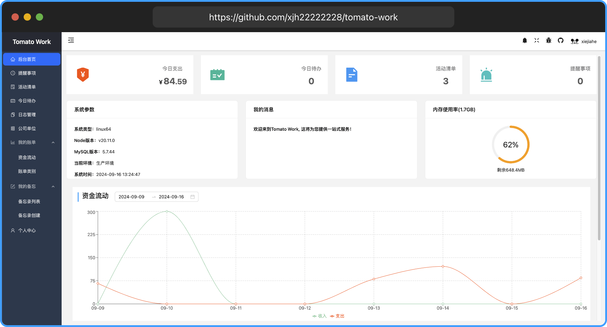

<p align="center">
  <a href="https://work.xiejiahe.com">
    
  </a>
  <br />
  <b>Tomato Work 个人事务管理系统</b>
  <p align="center">
    <a href="https://github.com/xjh22222228/tomato-work-server">服务端 </a>
    <a href="https://github.com/xjh22222228/tomato-work-weapp"> 小程序</a>
  </p>
  <p align="center">
    <a href="https://github.com/xjh22222228/tomato-work/stargazers"></a>
    
    
  </p>
</p>


## Online preview
[Follow me](https://work.xiejiahe.com)




## Tech
React hooks / TypeScript / Redux / Antd ...


## Todo list
- [x] github登录
- [x] 提醒事项
- [x] 活动清单
- [x] 今日待办
- [x] 财务管理
- [x] 个人中心
- [x] 我的备忘 - 支持Markdown & WYSIWYG
- [x] 站内消息
- [x] 邮件推送 - (github邮箱必须设为公开)
- [x] 微信推送 - 感谢Server酱 (需要在个人中心设置sckey)
- [ ] 单词备忘
- [ ] 微信登录
- [ ] 日报管理


## Build Setup
``` bash
# install dependencies
yarn

# serve with hot reload at localhost:9663
# user: test, password: 123456
yarn start

# build for production with minification
yarn build
```


## Support open source


---

## License
[MIT](https://opensource.org/licenses/MIT)


